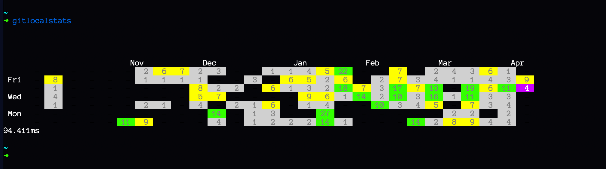

# GitLocalStats

--------------------

# Dependencies & Building

```sh
~$ go get -u gopkg.in/src-d/go-git.v4/... # For git api
~$ go get -u github.com/joho/godotenv     # For configuration
~$ go build
```

--------------------

# Usage

If you want to use this project, make sure there is a .gitlocalstats file in your home directory that contains
your email and the path to your repos.

```
email=my-email
folder=/path/to/repos
```

The project will recursively scan through the file system looking for git repos starting with the
folder you specify in .gitlocalstats. 

```sh
~$ ./gitlocalstats
```

since it's a long command I recommend aliasing it or copying it to some bin/ directory in your PATH to be run anywhere

```sh
~$ mkdir ~/bin 
~$ PATH="$HOME/bin:$PATH"
~$ mv gitlocalstats ~/bin/gitlocalstats
~$ alias gls="gitlocalstats"
~$ gls
```


